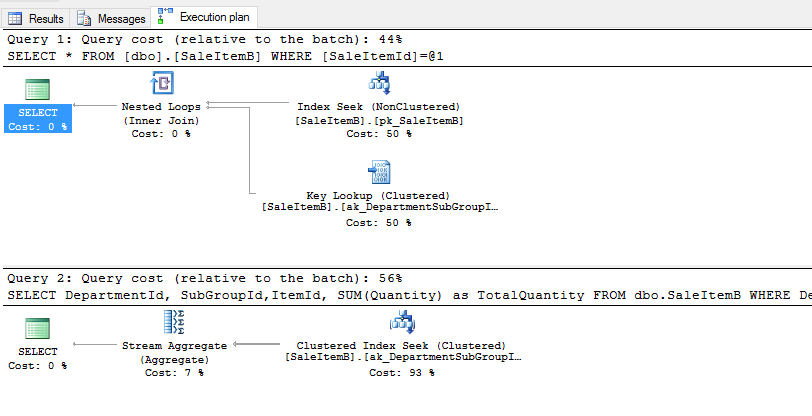
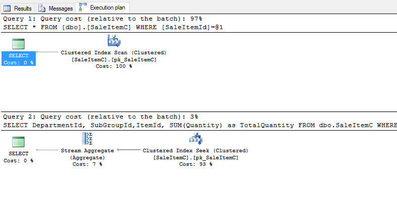

# Choosing a Primary Key


## Table of contents
1. [Introduction](#introduction)
2. [Some Fundamental Truths](#fundamentalTruths)
    1. [-What are some of the Gotchas](#gotachs)
3. [Some Simple Real World Realities](#realities)
    1. [-Integers](#integers)
    2. [-Dates](#dates)
    3. [-Strings](#strings)
    4. [-GUIDS](#guids)
4. [What are some of the big Questions](#questions)
    1. [-What is the Purpose of the Table](#purpose)
    2. [-What are the Expected Transaction Volumes](#volumes)
5. [Primary Key Demo](#demo)    
    1. [-Clustered Index Primary Key, Non-Custered Seondary Index](#clustered)
    2. [-No-Clustered Index Primary Key, Clustered Secondary Index](#noclustered)
    3. [-Composite Clustered Primary Key, No Secondary Index](#composite)
5. [Conclusion](#conclusion)         

<a name="introduction"></a>

## Introduction

Choosing the right Primary Key for a SQL table would seem to the laymen to be a very simple thing to do. In reality there are many things that you need to ask yourself about the data, the design as well as intended use.

Essentially the Primary key on a table is the mechanism through which SQL searches for the data you are looking for.  It has impact on anything you would want to do with the Table; inserting, updating, deleting or just plain joining to the table. 

For more information on the principals of Databse design you can refer to a previous post on [Introduction to Database Design](IntroductionToDatabaseDesign.md).

<a name="fundamentalTruths"></a>

## Some Fundamental Truths

There are some rules that govern creating primmary key values on SQL server tables.  These rules are based around the reality that a Primary Key is in actual fact a constraint


<a name="gotachs"></a>

### What are some of the Gotchas

- A Microsoft SQL Server Table can have only one Primary Key. (As they say in the movie Highlander, "There can e only one") 
- All columns that are added to a Primary Key cannot be nullable.  They wil be created not Nullable if you fail to specify that they are Not Nullable.
- If you did not realise it by now, it is by it very definition an Index that must have a unique value for each row in the table. If the chosen columns do not produce uniqueness, you cannot make it a Primmary Key. 

<a name="realities"></a>

## Some Simple Real World realities

Primary key columns can be any of the main SQL data types including strings. Each of the possible data types has consequences when chosen and implications when developing against them.  Cutting to the chase, just beacuse a partiicular data type can be made into a primary key does not mean it is a good idea. 

<a name="integers"></a>

### Integers

Integers are your friend.  If you are designing a new database you should as best as posible try and make all your Primary Keys integers. Internally under the hood SQL server is able to work with Integers faster than other data types in nearly every implmeted design. They allow for faster joins between tables, improved lookups and smaller Phsycial volume indexes which improves the performnce of the index itself.

<a name="dates"></a>

### Dates

I have unfortunately seen this in production quite often on various systems. Mostly on systems where people have called me to come and help them out with their database performance problems.  In a very simple like for like comparison an Integer is stored in 4 Bytes a DateTime in 8 bytes.  This naturally means you have doubled the size of reading volume for the index by using a date than would have been the case with an Integer. If your system is heavly transaction choosing a DateTime column for a Primary key is usually a done under the misguided belief that it would help out when writing reports that query the system on date ranges.

DateTime fileds are better suited to additional helper Indexes but not the Primary Key.  If you are adamant in your approach to wanting a date range searchable primary key then consider turning it into an Integer representation of the Date.  This can be something similar to interanl storage value which actually has very little meaning when visually seen or just make the date 2017-01-01  equal the Integer 20170101.  This will allow you to maintain your search options.  

Still at the very least in my experience it is not a good idea to use date,  I would strongly advise against it if you want a fast system.
 
<a name="strings"></a>

### Strings

Not as bad as dates but not as great as Integers. Problem is speed when SQL has to potetnially compare and search ever increasing String sizes.  I have often seen Char fields Storing Currency or Country ISOCodes being made into a Primary Key. A specified, specifc sized char field in those circumstances does not perform to badly on a table that does not have millions of rows. String Codes such as ISO Codes, Product Codes I would rather put a second index on them and hae a surrogate/Anonymous Integer as the Primary Key.

<a name="guids"></a>

### GUIDS

In the last few years I have seen more and more tables where a GUID/UniqueIdentifier is used as a Primay Key.  Each time I have to resist the urge to seek out and torture the individual responsible.  Then I remember that going to prison over somomes bad database design is not a very good use of my time.  Taking into account the same concept as why date is bad, a GUID in SQL is stored in 16 Bytes.  That is 4 times bigger than an Integer. I might in another post continue my rant on why I do not Like GUIDS as Primary Keys.  

I do believe GUIDs have a place but not in a Primary Key; stick to a Surrogate Integer Key. 

<a name="questions"></a>

## What are some of the Big Questions

When designing a table the are are a few questions that need to be answered to decide adequately what type of primary key you will need. These qusetions usually relate to the production nature of the talbe and how it will be accessed and used.

<a name="purpose"></a>

### What is the Purpose of the Table

The below are some of the more simple questions that can start pushing you into the right direction for a Primary Key Choice.

#### Is the table part of an OLTP system

OLTP systems have a variety of different table types.  

- Transactional
- Small Attribute Tables that foreign key to transactional tables
- Large Attribute Tables such as your Customers

The main focus on a transacitional table is to ensure that inserts are extremely fast. You are also trying to get as many rows stored on a data page as possible so you should try to not include too many columns. If the columns seem to be getting more and more consider breaking the table apart.

#### Is the Table part of a Warehouse?
Data warehouses by definition are there for the purpose of reporting and data analysis. In most data warehouses, data retrieval trumps inserts. The choice of primary key should allow for well defined Clustered data lookups and reads that support aggregations of data in the logical representation of how people percieve the data to add value to their organisation. In may cases well planned composite primary keys allow for good data retrieval of data when needed in specific groupings. It is important t note that the choice of primary key for the Datawarehouse table can and in most cases, should be different to its original parent table in the OLTP database.  This is in most part because they have different needs with regards to Insert versus retrieval of data. It is important to note that factors such as pre-aggregated tables and report caching tools could also have an impact on whether or not you build your primary keys for insert or retrieval speeds.

#### Is the Table part of a data Mart?
Many of the Data Marts that  have seen in the last few years are doubling as the actual data warehouse.  If that is the case in your current infrastructre then the choise of Primary Key should follow the same logical needs of the datawarehouse where data retrieval is prefered over inserts speeds.

#### Is the table part of a staging process?
In my experience, staging databases share the needs of both insert and retrieval considerations. How you design is dependant largely on the volume of data that passes throygh the staging area and the amount of Aggregations that you are preparing. What is most important is that you remember to move the data off the OLTP system into the staging area before begginning any aggregations.  So the initial table might be prepped for insert.  The aggregation query looses retrieval perfromance but then stores the aggragation into a structure designed for a Composite primary key that is good for retriving the data before its movement to a mart or warehose. 

<a name="demo"></a>

## Primary Key Demo

The below demo is extremely simplified but will illustrate the changing behaviour of MSSQL with slightly different approaches to choice of Primary Key and Indexes.  The results are very specific to what I will have built from a design perspective. It is alwyas important that you test your own Table and Primary Key choices as the results will vary in many different ways just like the example.

<a name="requirement"></a>

### Demo Business Requirements

Currently the organisation has a Product table classification that is set up as follows:


The design logic is prestty simple and not meant to be something special. Intended use as follows.

- **Department** Table stores things like Mens, Womans, Kids etc.
- **SubGroup** Table stores things like TShirts, Shoes, Shorts etc.
- **DepartmentSubGroup** table stores the mappings of what Sub Groups belong to a department.
- **DepartmentSubGroupItem** table stores the actual Item associated with the the DEpartment And Sub Group.  Important to note that it is an Identifying relationship in the example to build a composite key for demo purposes. 

This department mapping is going to be used in Association with the Sales table to identify the item being sold. the code examples will assume the existance of the above structure and merely focus on the different options avaialble to the Sales Table. We will be looking at the following Sale Table design options:

- Sale Table with a Clustered Integer Primary Key and a secondary non-Clustered index on the Attribute Table DepartmentSubGroupItem.
- Sale Table with a Non-Clustered Integer Primary Key and a secondary Clustered index on the Attribute Table DepartmentSubGroupItem.
- Sale Table with the DepartmentSubGroupTable as an Identifying Parent Table creating a composite primary key, no secondary index required.

All the below table structures were populated with a random generated 50 000 rows.  The script can be found here:

[Load Script](PrimaryKeyTableLoad.md)

<a name="clustered"></a>

### Clustered Index Primary Key, Non-Custered Seondary Index

The below table create is something that I have unfortunately seen all too often now days. Someone justs slaps in an Identity primary key wihtout really thinking, defaultng it to Clustered, realising at a later point that they need some performance on queries realted to other columns and then slap on a another non clustered index on the relevant columns.

```sql
/*** Create table with IDENTITY column as Clustered Index ***/
/*** with Non-Clustered Secondary                         **/

IF (OBJECT_ID('dbo.SaleItemA', 'U') IS NULL)
BEGIN    
  CREATE TABLE dbo.SaleItemA(
    SaleItemId       int IDENTITY(1,1),
    DepartmentId     int NOT NULL,
    SubGroupId       int NOT NULL,
    ItemId           int NOT NULL,
    Quantity         int NOT NULL,
    CONSTRAINT pk_SaleItemA PRIMARY KEY CLUSTERED (SaleItemId)
    );

  IF NOT EXISTS(SELECT 1 FROM sys.indexes 
                WHERE name = 'ak_DepartmentSubGroupItem_NonClustered')
  BEGIN
    CREATE NONCLUSTERED INDEX ak_DepartmentSubGroupItem_NonClustered 
        ON dbo.SaleItemA (DepartmentId, SubGroupId, ItemId); 
  END
END
GO
```

If we run the following very siplistic code with get QueryPlan on:

```sql
SELECT * 
FROM dbo.SaleItemA
WHERE SaleItemId = 25000;

SELECT DepartmentId, SubGroupId,ItemId, SUM(Quantity) as TotalQuantity
FROM dbo.SaleItemA
WHERE DepartmentId = 5
  AND SubGroupId   = 5
  AND ItemId       = 5
GROUP BY DepartmentId, SubGroupId,ItemId;
```

We get the following:


The quesry plan shows us expected behaviour.  Looking at a specific value up on the Clustered Primary Key Identity Field produces a good plan.  The aggregation accross the secondary non clustered index results in the expected seek.  On Face value this does not see to be too bad if you do not require a degree of lookups taking place on the fileds in the secondary Index.

<a name="nonclustered"></a>

### Non-Clustered Index Primary Key, Clustered Secondary Index

This type of option at least shows a little extra thought went into the table design.  The Identity was chosen most likely for simplicity or for quick insert.  The designer however knew that they would need to entertain lookups and therefore cluster the secondary index.
```sql
/*** Create table with IDENTITY column as Non-Clustered Index ***/
/*** with Clustered Secondary                                 ***/

IF (OBJECT_ID('dbo.SaleItemB', 'U') IS NULL)
BEGIN    
  CREATE TABLE dbo.SaleItemB(
    SaleItemId       int IDENTITY(1,1),
    DepartmentId     int NOT NULL,
    SubGroupId       int NOT NULL,
    ItemId           int NOT NULL,
    Quantity         int NOT NULL,
    CONSTRAINT pk_SaleItemB PRIMARY KEY NONCLUSTERED (SaleItemId)
    );

  IF NOT EXISTS(SELECT 1 FROM sys.indexes 
                WHERE name = 'ak_DepartmentSubGroupItem_Clustered')
  BEGIN
    CREATE CLUSTERED INDEX ak_DepartmentSubGroupItem_Clustered 
        ON dbo.SaleItemB (DepartmentId, SubGroupId, ItemId); 
  END
END
GO
```
Running the same query against this table:

```sql
SELECT * 
FROM dbo.SaleItemB
WHERE SaleItemId = 25000;

SELECT DepartmentId, SubGroupId,ItemId, SUM(Quantity) as TotalQuantity
FROM dbo.SaleItemB
WHERE DepartmentId = 5
  AND SubGroupId   = 5
  AND ItemId       = 5
GROUP BY DepartmentId, SubGroupId,ItemId;
```



The plans show results as expected.  Now that the identity is no longer clustered the simple lookup on the primary key is not as performant as the previous table design.  The aggrergation query on the other hand is now vastly improved as it targets the clustered secondary index.

<a name="composite"></a>

### Composite Clustered Primary Key, No Secondary Index

Over the years I have become a big fan of composite primary keys that naturally flow from 3rd normal form database design.  Especially if you are not yet sure what the data retrieval and lookup needs are going to actually be for a new system.  Guessing often results in a design that misses the eventual need of the business.  It by its very nature when load starts to increase mitigates hotspotting during inserts.  The previous table designs often get table partitioning added to them to reduce hotspotting when they realise that the Identity is not coping duing insert. Most not realising at the time that they have just built a composite primary key.

```sql
/*** Create table with Composite Clustered Index ***/
/*** with no Secondary                           ***/

IF (OBJECT_ID('dbo.SaleItemC', 'U') IS NULL)
BEGIN    
  CREATE TABLE dbo.SaleItemC(
    DepartmentId     int NOT NULL,
    SubGroupId       int NOT NULL,
    ItemId           int NOT NULL,
    SaleItemId       int IDENTITY(1,1),
    Quantity         int NOT NULL,
    CONSTRAINT pk_SaleItemC PRIMARY KEY CLUSTERED (DepartmentId, SubGroupId, ItemId, SaleItemId)
    );

END
GO
```

Running the same query against against the composite Primary Key design:

```sql
SELECT * 
FROM dbo.SaleItemC
WHERE SaleItemId = 25000;

SELECT DepartmentId, SubGroupId,ItemId, SUM(Quantity) as TotalQuantity
FROM dbo.SaleItemC
WHERE DepartmentId = 5
  AND SubGroupId   = 5
  AND ItemId       = 5
GROUP BY DepartmentId, SubGroupId,ItemId;
```


In the case of the Composite Primary Key we get good results for the agregation query beecasue of the key being composite.  Direct lookups at the level Identity level are acceptable but would probably be improved if we added a secondary Non Custered Index on it. What is importatnt to not is that out the gate it gives acceptable all round query otions on the data wihtout needing to add additional indexes which in themselves carry overhead. 

<a name="conclusion"></a>

## Conclusion

Do any of the results above explicity show one design option better than another, the answer is NO, not really!  What they do show is that choosing a certain option has an expected consequence in future behaviour of queries against the object.  What does ths mean?  

- Find out what type of data needs to be returned most often from the Table then look at a Primary Key or Secondary Index to matach.
- What are the expected data volumes and is Hot spotting on insert a potential future problem, then choose accordingly.
- Try various options.  Populate the table with volume and then simulate its expected load in prodcution. Target the object with various types of expected queries it wil be subjected to in production.  Arm yorself with information before just randomly choosing a simple Primary Key option like an Identity, or a more complex composite Key.

Knowing the expected transactional activity against the object at the very least gives you a fighting chance to choose indexes that will perform well into the future. When that type of knowledge is not freely avaialble; then purely out of my own experience over the years the composite indexes that natrually form during database design often cover most requirements in an acceptable way. Not neccessarily the best in any area but an acceptable average performer.   

What is important to note is that in complex, high transactional systems the design is opften a trade off against what is of greater importance from a speed perspective.  In many case some types of queries just have to draw the short straw and be non performant as just continually slapping on Indexes does not always improve perfromance overall in the long run.


## Disclaimer
This is my personal blog. The views expressed on these pages are mine alone and not those of my employer.

© 2017. All rights reserved.


