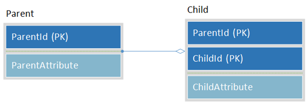
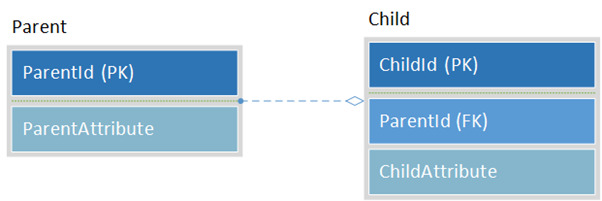
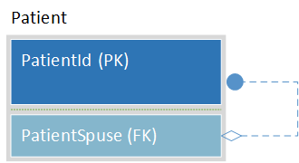
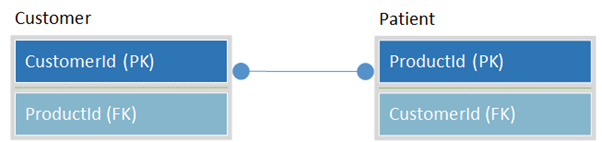

# Introduction to Database Design

## Table of contents
1. [Introduction](#introduction)
	1. [-Overview](#overview)
    2. [-Scope](#scope)
    3. [-Target Audience](#targetaudience)
2. [Fundamental Terminology](#terminology)
    1. [-General Terminology](#generalterminology)
3. [Database Normalization](#normalization)
	1. [-First Normal Form](#1stnf)
	2. [-Second Normal Form](#2ndnf)
	3. [-Third Normal Form](#3rdnf)
	4. [-BOYCE-CODD Normal Form (BCNF) 3.5](#bcnf)
	5. [-Fourth Normal Form](#4thnf)
	6. [-Fifth Normal Form](#5thnf)
	7. [-Removing Data Redundancy](#removingrdundancy)
	8. [-De-Normalization](#denormilization)
4. [Language of Data modeling](#datamodelling)
	1. [Unpacking and Entity](#entity)
    2. [Relationships](#relationships)
5. [Database Design Sequence](#designsequence)
	1. [Conceptual Phase](#conceptual)
    2. [Logical](#Logical)
	3. [Physical Phase](#physical)
   

# Introduction

## Overview

Far too few database developers in this day and age get the opportunity to learn how to design relation databases.  In most cases, they will on occasion be asked to add a few objects to an existing system while following the standards of the organisation.  Often these standards are suspect at best and are merely followed for conformity, convenience and to avoid making waves. 

These relatively infrequent changes do not hone the skills needed for effective design.  As such there is often a slow but continuous loss of overall good design principal over the life of the database.  Bolting changes on that really should have had more reflection before implementation only leads to one inevitable outcome.

In the world of Business applications the database can be described as the foundation to the system.   Clients can easily be rewritten or skinned differently.  Databases on the other hand carry across with them implications such as migrations, history and data volume which in all major modification scenarios often lead to downtime.  Taking that into account it is always a great surprise to me how the database design portion of the product often gets the shortest development cycle in the process.

If you have built a database that was designed to be a single story building, there is no way you can build a second story on top of it without ripping out the foundation that has already been laid.  To maintain database performance it is critical to understand that continuous unplanned additions done in an unplanned way jeopardise the future of the product.  It does not take a rocket scientist to know that no matter how awesome the house looks; if the foundation is faulty, trouble is only a few short CPU cycles around the corner.

This state of being is why it is even more important that the average DB developer be more prepared to produce better designs in the very restricted development windows that exist.

## Scope

The purpose of this post is to present the basic introductory understandings and concepts that should be adhered to when designing database objects.  It is unavoidable with the subject matter to not require an understanding of basic key terminology.  That being said the onus is being left on the course attendees to investigate further if knowing the 100% definition of anything is an absolute must in their world.

I however, will attempt to convey the principals and necessary questions that should be asked when designing without getting bogged down with too much of the technicalities.  Knowing word for word definitions are not needed for good design if the principals of what is trying to be achieved are understood and followed.  Database design by its very nature is literally a cookie cutter implementation of the same principals over and over.  Follow them and your databases will have a long and sturdy future.

## Target Audience

A myriad of people will be able to benefit from understanding the principals of design that will be presented.

1. Naturally the benefit to people already responsible for design considerations at a database level will leverage the most from the course.
2. Client developers who want to have a look at the Dark side and see how the other side has to live and why they are often asked to do something completely daft and foreign.
3. Testers who wish to be able to provide useful feedback as to potential design flaws by understanding future caveats of new designs.
4. Support personnel who are interested in being able to interpret and understand the implications of what they are seeing from a design perspective.

# Fundamental Terminology

Most of the complex definitions in this section need not be learnt or understood 100 percent for good basic database designs to be made.  Knowing them and understanding them do allow for being able to interpret and comprehend the more advanced concepts in books and published papers on database design.  So for the more serious participant in this course, it would definitely be beneficial to spend a bit more time learning these concepts inside out!

## General Terminology

1. **Data Element** is an atomic unit of data that has precise meaning.  (Read up on Metadata for more understanding.  Often implanted in production with overloading which means there is multiple meanings to the single data element which breaks the conceptual understanding of a single precise meaning.  This is an extremely bad practice and now requires domain knowledge to interpret information.
2. **Data Domain** refers to all the values that might be contained in a Data Element.  In laymen terms the range of data that can be stored.  In most cases it is restricted by choosing a Data Type for a Column. 
3. **Entity** Loosely defined as a table.  Normally used in the Logical or Conceptual understanding of a Design. Definitions vary as the academics try to one up each other in how smart they are.  For our purposes an Entity is a table for design purposes.  When we define the final schema of the table then we refer to it as a table in its physical form.
4. **Row versus Record** Often used interchangeably but in reality Row refers to the actual data where each column represents a single piece of data, referred to in later publications as a tuple.  A Record on the other hand is usually used to describe the final resting place of the information in a file on Disk.  

# Database Normalization

The whole point of Database Design is to try and eliminate redundant data and to ensure that the eventual design results in the data being store in an efficient and logical way.  How we achieve this is by adhering to the concept of data normalization.  Data Normalization as a topic can have entire books written about them.  The definitions provided below have been simplified to make sense in context of basic design.  Understanding of all aspects of Normalization is not required to implement a good database design.  However knowledge of them will definitely help you in certain cases where the design requirement is out of the norm. It is therefore recommended that you take some time to read up on normalization to be able to better interpret the designs you are looking at as well as future design you might be responsible for.  Knock yourself out if you want to read up more in depth information on this. A deep dive is out of scope for an introduction to database design.

Without Normalization we end up needing to deal with Update, Delete and Insert Anomalies where targeting a specific row is very difficult and in some cases relatively impossible.  At the very least a table/entity should be designed with a minimum of First Normal Form.  When starting down the line of showing examples of specific normal form you will actually start to notice that you begin showing aspects of other Normal form at the same time which is why it is almost always easier to just design to 3rd Normal form as a base starting point as most parent child designs end up there almost by default.

### First Normal Form

An entity that is designed in First Normal Form must follow certain rules to be classified as 1st Normal Form.

1.	The entity should be organized into rows.
2.	Each row should have a unique primary key that may or may not be a composite.
3.	No Two Rows should have repeating Information.  Each combination set of columns should be unique.
4.	No Individual Column should contain more than one value, in other words a column should have no separators suggesting multiple values.

### Second Normal Form

A Table is considered to be in Second Normal Form if:

1.	It meets all the criteria of a 1st Normal Form.
2.	If the primary key is a composite of attributes (Multiple Columns), the non key columns must depend on the whole composite key.

### Third Normal Form

A table is considered to be Third Normal Form when:

1.	It meets the criteria of 2nd Normal Form.
2.	Each Non-keyed attribute column does not depend on the entry in another Key Column. (No Foreign Key relationship)

### Boyce-Codd Normal Form (BCNF)3.5

A database table is in BCNF if and only if there are no non-trivial functional dependencies of attributes on anything other than a superset of a candidate key.

### Fourth Normal Form

A table is considered to be in Fourth Normal Form if:

1.	It meets the criteria of 3rd Normal Form.
2.	Scenarios in which non-keyed attributes depend on the key-column exclusive of other non-key columns are eliminated. 

### Fifth Normal Form

A table is considered to be in Fifth Normal Form when:

1.	It meets the criteria of 4th Normal Form.
2.	The Table consists of Key Attributes and Non-Key Attributes as well.

## Removing Data Redundancy

The below Entity is a simple record set of people, their age and the various qualifications they have.

What is important to notice is that the Education column does not store a single piece of information but a list?  This is by all normal DB design standards a bad Idea.  So naturally we want to remove the list as part of the first step.

Now we have:

This is much better as we no longer store more than 1 piece of information in each column.  It has however produced a rather large amount of repetition of the person and most notably their age.  If this table happened to hold millions of university students over their life span of studying at various linked institutions this repetition of data can result in significant storage implications as well as potential performance hit. 

To start getting around this we need to start breaking out the various pieces of information into their own entities.  How to do this in a more formalized way is discussed later but for now let us keep it simple and just remove the User from the data set and see what we can come up with.

We not only move the User out but any information that is pertinent to the user that we would also only want to store once for the user.  In this example age is a good candidate to be moved into the new User entity.

Now that we have a new entity we create a parent child relationship between the new entity and the information left behind in the old one.  The solution now looks as follows.

Now we have reduced the unnecessary repetition of the Users information which in most live systems is often a very wide entity with many columns.  Following on with the principal we can also collapse the education column into its own Entity to avoid duplication of large text fields and to improve the overall integrity of data in the system. The end result looks like:

## De-Normalization

De-normalization is a tool for both good and evil.  In most cases it is used to flatten the dataset, removing parent child relationships in favor of wider table definitions.  When applied for the right reasons de-normalization can vastly improve overall performance of heavy transactional systems.

### Simple example for Denormalization

**Requirement: Store multiple balances**

The example below shows a typical parent child relationship between User, BalanceType and UserBalance.  You can also see the de-normalized representation in table UserBalances where the BalanceType parent has been flattened out to create a table storing multiple balances across.  Note that the de-normalized table has a plural name, the only time a plural is ever acceptable for an Entity name.

# Language of Data Modelling

Data modeling is where all the magic happens.  It is the single most important tool for database design.  It is the canvass on which your design creativity takes place.  The whiteboard used to come up with the desired outcome.  It becomes your visual representation of what the data flow and relationship between entities are.

There are a variety of different products that allow for database design modeling.  For this training all examples will be done using Microsoft Visio.  When beginning a design there are a variety of different design standards that can be used.  The most prominent and common are:

- UML Database notation
- Crows Foot Database Notation
- IDEF1X Database Notation

Each has their own pros and cons when choosing which one to use.  They will all lead to the same design output at the end.  What is important is that you understand the principals of Data Modelling as they are all based on them.  The one you choose is almost always a personal preference after playing with the variations of each.

Each of the various modelling options allows you to define:

- Entities/Tables
- Attributes/Columns
- Relationships
- Descriptive Information

## Unpacking an Entity

When designing a Model an Entity is almost always a direct representation of a future table within the database.  It is therefore preferable to ensure that certain standards are followed when defining your entities within your model diagram.

- Entity names should never be Plural. (Unless for some reason you have collapsed data, the plural naming suggests to anyone who knows design that they are immediately looking at intentional de-normalization.)
- The name should be a very descriptive to what the Entity is modelling.  Always be mindful that an entity should always store only one type of information.  There should be no double meaning to information stored within an Entity.
- Avoid Hungarian notation.  This is a design for a database.  Prefixes, suffixes and the like should be avoided at all costs.  The Entity Object itself should be hidden from the clients that intend to use it.  They should not know that they are looking at a view or a table when it is all done.  That way client demands do not destroy the essence and intent of a design. (That being said.  Follow the naming convention of your organization, whether right or wrong.)

### Column/Attribtes of an Entity

All columns must be uniquely named.  They need not inherit the prefix of the Entity name.  For example if the entity is Called Product, the Column can merely be called Description rather than ProductDescription as being an Entity with only one type of data the description by association belongs to the Product Entity.

If your design has many Entities with description columns, concessions can be made.  In such situations it is completely acceptable to prefix with the Entity name to avoid confusion.  This should be a last resort as confusion to client developers can be alleviated with parameter naming and different column names in views.

### Pirmary Keys

Every Entity should have a Primary Key without exception.  The primary key can be a Singular column or contain multiple columns.  Initial choice of primary key and name within the model is mostly to ensure correct relationship choices.  More often than not the actual name will become different when you finally create the physical Database scripts themselves.

Without fail the use of integer fields produce the fastest performing live production implementations for primary keys. Avoid dates, Strings as well as GUIDs which normally sparks heated debate, especially if you want a performant system!

### Foreign Keys

Are the migrated Attributes/Columns from another Entitys Primary Key.  They are the fundamental building blocks within a Relational Database Design.  They can be both defining to an Entity or merely an attribute.

### Domains

Domains as defined before are how we restrict the nature and type of information that can be entered into a specific column or attribute.  It is extremely important to be aware of the intended data volumes when choosing your domain restrictions.  Often a request will be made to store a blob when less than 1% of the data needing to be stored is a Blob.  In these cases it is more performant to provide separate Entitles for the exceptions rather than design specifically for them as a default.

## Relationships

Relationships are the fundamental points behind all database design.  The relationships between entities allow a developer to interpret correct behavior as the design tells a story of how things are glued together within a system.  If the design does not follow logical design standards and patterns then domain knowledge of the system is required, increasing key personnel dependency.  All relationships are defined by the traditional Parent Child entity relationship fundamentals.

IDEF1X definitions:

- **Entity, Child**: The Entity in a Specific connection relationship whose instances can be related to zero or one instance of the other entity (parent entity).

- **Entity, Parent**: An Entity in a specific connection relationship whose instance can be related to a number of Instances of another entity (child Entity).

- **Relationship**: An association between two entities or between instances of the same entity.

### Identifying Relationship

Identifying relationship is when the primary key of one table is migrated to the primary key of another.  The child will be a dependant Entity.

An identifying relationship defines an entity and essentially means that that entity will have that descriptive attribute for its entire existence.  It is very difficult to change once in production so due consideration and thought needs to be made to determine if it is necessary.

### NonIdentifying RelationShip

Non-identifying relationship is when the primary key of one table is migrated to the non-primary attributes of the other.  The child will be an independent Entity if no other identifying relationship exists.

This is a very common relationship and is often used to ensure that an entity has very descriptive attributes that can be expanded upon and to maintain data integrity of the entity.  Limiting what can be added into the attributes themselves by the restrictive foreign key.

### Optional Identifying

Optional Identifying occurs when the non-identifying relationship do not require a child value.  A simple example is a foreign key where the columns are defined as Null able so the attribute does not need to be filled in.

### Recursive (Fishhook)

Recursive relationship is when a table is related to itself.  In many cases in live production the Patient table will invariably be a parent to two fields in a child table as an alternative design.  This design would normally allow two mappings to eventually exist to resolve either husband and wife or wife and husband.

### Many to Many

Many-to-many are often more of a theoretical scenario which is seldom the end result of the final Physical design.  The fact that certain relationships are possible in a sort of Cartesian join does not always translate into a viable scenario in production.  That being said there are scenarios where these relationships do solve very specific business requirements despite being very difficult to resolve for reporting purposes.

# Database Design Sequence

When designing Databases the decisions and steps taken are essentially a continuous circle of rinse and repeat.  Basically a set of cookie cutter operations that must be performed over and over again till the design is complete.  The repetition and Designer’s experience improves decisions made at conceptual crossroads reducing the iterations needed for the final product.

## Conceptual Phase

In this phase the design process begins and all faculties need to be brought to bear on the problem at hand.  Establishing the requirements is the first step to laying the foundation for the whole Database Design.  Patience is needed to ensure that the foundation is not rushed.  This is the one part of life where over analysis of the problem is not a bad thing.  You want everything on the table before beginning to discard and choosing what is relevant.

This makes it extremely important that you find yourself a partner in crime. During any design phase; **Collaboration** is your friend providing the following advantages:

1.	Different minds interpret the same information differently.  Thus ensuring that differing opinions and insights are merged in requirements gathering.
2.	Experiences of the different designers and architects can shorten design iterations by bringing to the table knowledge of tried and tested alternatives.
3.	Multiple applied minds can sense check ideas in a more holistic way and reduce the risk of erroneous interpretation of requirements.

### Get the Requirements

This is often the most difficult part; consolidating all the information that pertains to the requirements.  Seldom is it provided in a single document and often requires additional leg work from the designer is required to narrow down the information and gain the necessary clarity within the clutter.

Take the time to understand and find as much as possible about the requirements.  Later in the process a new piece of missed information could change the overall design in a very significant way.  Catching such a caveat up front reduces wasted time and effort.  This is definitely a stage where a little more persistence and patience in determining requirements flattens out the chaotic ups and downs that come from designing systems.

When all the information is achieved break it down into the relevant Entity needs and key points relevant to design implication.  Remove the peripherals that are not relevant to the actual database requirements.  Produce a new list of database specific needs and crosscheck that it will deliver what is needed for the project. This will be used as a sanity check as the design starts to take shape.

### Figure Out the Consumers

The importance of this can never be overstated.  The person or parties that require the new design are often not the only people who would potentially be interested in it and what it has to offer.  Taking into account that other parties might be interested can significantly change the way you look at providing information, the relationships and the grouping thereof.  In many cases it will also expand the nature of the information you choose to include in your design.

New systems often become more important to other departments than the department that originally requested the system.   They tend to gain a life of their own as a different consumer gains more benefit from the system that the team it was originally designed for.

### Prepare Logical Entities

Think of this in the same way as brainstorming; add an entity for every single piece of information you can think of; do not hold back.  Avoid the inner voice that is trying to make rhyme or reason from the specifications and just brain dump everything.  Clarity will be determined in a later phase.  Even if you think it is irrelevant or does not form part of what will eventually be, just add it anyway. 

Try not to apply to much thought as to why an Entity is there; just make sure it is there.  The Entity itself might become multiple objects down the line but in this phase we are only trying to create a place holder for something we know needs to be interrogated in depth.

## Logical Phase

The Logical Phase is the stage at which the Conceptual phase is refined.  Now you can let the creative juices start to flow to interpret and figure out all aspects of the conceptual phase.  It is important to remember that at this stage we do not take into account what technology will be used to implement the system.  In other words do not start building the design for a specific database such as Oracle or MSSQL.  Completing the following rounds out a plan for the final system:

-	Drill into the Conceptual Model and expand all Entities.
-	Figure out what Entities are attributes and what Entities need attributes.
-	Follow the rules of normalization.
-	Figure out the primary keys and respective foreign key attributes.
-	Finalize the definition of all relationships.
-	Determine an appropriate domain for each attribute and key. 

It is important to note at this point that good naming conventions should be used to define your growing parent child entity relationships.  The names themselves need only make sense to the database not any potential client that would like to retrieve or work with the entities created.  More details for this will be provided in the Physical Phase.

## Physical Phase

